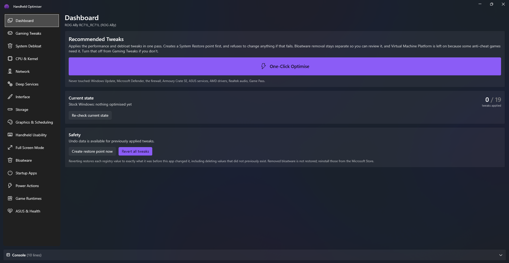
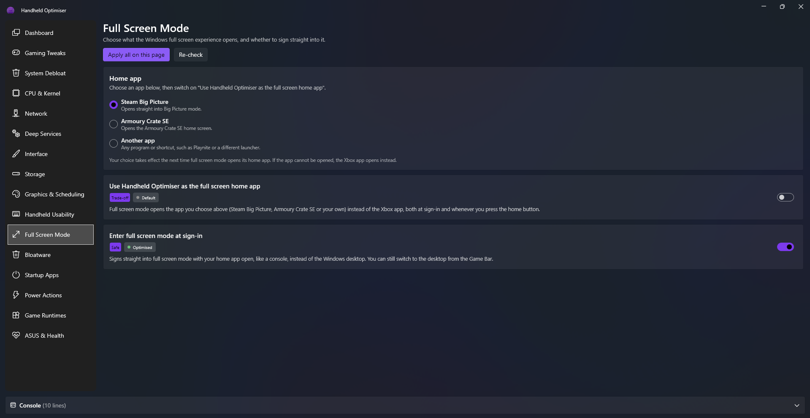

<p align="center">
  
</p>

<h1 align="center">Handheld Optimiser</h1>

<p align="center">
  A Windows tuning app for the ASUS ROG Ally and other Windows handhelds.<br>
  More frames, less clutter, and a console-style full screen mode, with every change reversible.
</p>

<p align="center">
  <a href="https://github.com/Vip3RAli/handheld-optimiser/releases/latest"><b>Download the latest release</b></a>
</p>

<p align="center">
  
</p>

---

## What it does

Windows ships set up for a desktop PC, not a 7-inch handheld. Handheld Optimiser applies the changes handheld owners usually make by hand from forum posts and scripts, from one touch-friendly app:

- **One-Click Optimise** applies the recommended performance and debloat tweaks in a single pass.
- **Individual toggles** for every tweak, grouped by area, each showing whether it is currently applied.
- **Xbox mode home app**: make Windows' full screen experience open Steam Big Picture, Armoury Crate SE or any launcher you choose.
- **Maintenance tools**: clear shader caches, free space with Compact OS, install missing game runtimes, and remove preinstalled apps.

## Built to be undone

Every system change goes through the same safety checks:

- **A System Restore point is created first.** If Windows cannot create one, nothing is changed.
- **Every tweak records the original setting**, so it can be reverted on its own or all at once with **Revert all tweaks** on the Dashboard, even after restarting or updating the app.
- **Protected components are never touched**, whatever a tweak asks for: Windows Update, Microsoft Defender, the firewall, Armoury Crate SE, ASUS services, AMD drivers, Realtek audio and Game Pass.
- **Trade-offs are shown up front.** Anything that lowers security or turns off a feature is labelled on its card and listed in the confirmation before it runs.

## Install

1. Download **HandheldOptimiser-Setup-&lt;version&gt;.exe** from the [latest release](https://github.com/Vip3RAli/handheld-optimiser/releases/latest).
2. Run it. Windows may show "Windows protected your PC" because the installer is not code-signed yet: choose **More info**, then **Run anyway**.
3. Accept the administrator prompt. The app needs administrator rights to change system settings, so Windows asks each time it opens.

.NET is bundled, so nothing else needs installing. New versions install over the old one and keep your undo history.

**Requirements:** Windows 10 (2004) or Windows 11, 64-bit. Full Screen Mode needs Windows 11 24H2 or later on a device with the Xbox full screen experience. Designed and tested on the ROG Ally; most tweaks apply to any Windows handheld, but the ASUS-specific pages assume ASUS software is installed.

## Features

### Dashboard
One-Click Optimise, the current state of the system, a manual restore point button, and **Revert all tweaks**.

One-Click Optimise includes turning off **Memory Integrity**, which is usually the biggest single frame rate gain on the Ally but lowers protection against malicious drivers. The confirmation lists it, and every other trade-off, before anything runs. Virtual Machine Platform is left on because some anti-cheat games need it.

### Tweak pages

| Page | Tweaks |
|---|---|
| **Gaming Tweaks** | Disable Memory Integrity (HVCI) · Disable Virtual Machine Platform & VBS · Disable Game DVR background recording · Remove the Windows startup delay |
| **System Debloat** | Disable telemetry · Disable web results in Start search · Disable Cortana & Copilot · Stop app suggestions and silent reinstalls · Stop Store apps running in the background |
| **CPU & Kernel** | Maximise foreground priority, so the game gets the CPU ahead of background work |
| **Network** | Disable network throttling · Disable the network data usage monitor |
| **Deep Services** | Disable SysMain, Search Indexer, Print Spooler & Fax, Program Compatibility Assistant, Distributed Link Tracking, and other services a handheld does not use |
| **Interface** | Instant menus · Disable edge swipe gestures · Disable transparency and window animations |
| **Storage** | Disable last access timestamps · Disable 8.3 short file names |
| **Graphics & Scheduling** | Force Game Mode on · Enable hardware-accelerated GPU scheduling |
| **Handheld Usability** | Disable the Sticky Keys and Filter Keys shortcuts · Disable power throttling |
| **Full Screen Mode** | Choose the home app · Use Handheld Optimiser as the home app · Enter full screen mode at sign-in |

### Full Screen Mode (Xbox mode home app)

Windows 11's full screen experience normally opens the Xbox app. Handheld Optimiser can replace it with the app you actually use:

<p align="center">
  
</p>

1. Open **Full Screen Mode** and choose **Steam Big Picture**, **Armoury Crate SE**, or **Another app** (any program or shortcut, such as Playnite).
2. Switch on **Use Handheld Optimiser as the full screen home app**.
3. Optionally switch on **Enter full screen mode at sign-in** to boot straight into it like a console.

Handheld Optimiser then appears under **Settings > Gaming > Xbox mode > Choose home app**. Your choice can be changed at any time and applies the next time the home app opens. If the chosen app cannot start, the Xbox app opens instead, so you never land on a blank screen.

How it works: the app registers a small unsigned package that adds it to Windows' home app list and points at a lightweight launcher, which runs without administrator rights so full screen mode never shows a UAC prompt. No certificates are installed. Windows only accepts this kind of registration while developer mode is on, so developer mode is switched on for the few seconds registration takes and then restored to its previous setting.

### Bloatware
Remove preinstalled apps such as TikTok, Candy Crush, Disney+, Bing News and Copilot. Nothing is selected until you choose it, and apps you may want to keep are marked with a note. Store, Xbox, Game Pass, codec and vendor packages are protected.

### Startup Apps
Turn startup programs on or off, including 32-bit ones. Uses the same switch as Task Manager, so changes show up there too.

### Power Actions
One-off jobs, each run with a button:

| Action | What it does |
|---|---|
| **Flush DNS & reset Winsock** | Fixes online games that cannot connect or suddenly lag |
| **Clear shader caches** | Fixes stutter or graphical glitches after a driver update |
| **Force deep cleanup** | Removes superseded Windows Update files, crash dumps and error reports |
| **Compact OS** | Compresses Windows system files to free a few GB for games |
| **Undo Compact OS** | Reverses it, after checking there is enough free space |

### Game Runtimes
Scans for the Visual C++, DirectX, .NET, XNA, OpenAL and PhysX runtimes games depend on, and installs or updates them through winget.

### ASUS & Health
Checks that ASUS, AMD, Realtek, Defender, Windows Update and Game Pass services are running, and can re-enable any that were disabled by other tools.

## Uninstalling

Uninstall from **Settings > Apps > Installed apps**. Uninstalling removes the app but **does not undo tweaks**; use **Revert all tweaks** first if you want Windows put back as it was. Your undo history is kept, so reinstalling later can still revert everything. If Handheld Optimiser was your full screen home app, Windows goes back to the Xbox app.

## FAQ

**Why does Windows ask for administrator permission every time?**
Almost every change the app makes is machine-wide, so Windows requires it. The full screen home app launcher is separate and never asks.

**Why does Windows warn that the installer is unrecognised?**
The installer is not signed with a paid code-signing certificate yet. The SHA-256 hash of each installer is listed in its release notes if you want to verify your download.

**Something went wrong. What do I do?**
Use **Revert all tweaks** on the Dashboard, or roll back with the System Restore point the app created. Each session is logged to `%LOCALAPPDATA%\HandheldOptimiser\logs`, which is the most useful thing to attach to an issue.

## Building from source

Requires Windows, the .NET 8 SDK and Inno Setup 6.

```powershell
winget install --id JRSoftware.InnoSetup -e --scope user
.\installer\build-installer.ps1
```

This publishes a self-contained build, packs the full screen home app registration, and writes `artifacts\HandheldOptimiser-Setup-<version>.exe`. The version comes from `<Version>` in `src\HandheldOptimiser\HandheldOptimiser.csproj`.

| Folder | Contents |
|---|---|
| `src/HandheldOptimiser` | The WPF app. Tweaks are declared in `TweakDefinitions/`; `Services/TweakEngine.cs` applies them with the restore point and undo journal, and `Services/SafetyGuard.cs` holds the protected list |
| `src/HandheldOptimiser.HomeLauncher` | The small launcher Windows starts as the full screen home app |
| `installer` | Inno Setup script, build script, and the home app registration package in `HomeApp/` |

## Credits

- Full screen home app approach learned from [AnyFSE](https://github.com/ashpynov/AnyFSE) by Artem Shpynov (MIT).
- UI built with [WPF-UI](https://github.com/lepoco/wpfui) and the [CommunityToolkit MVVM](https://github.com/CommunityToolkit/dotnet) library.
