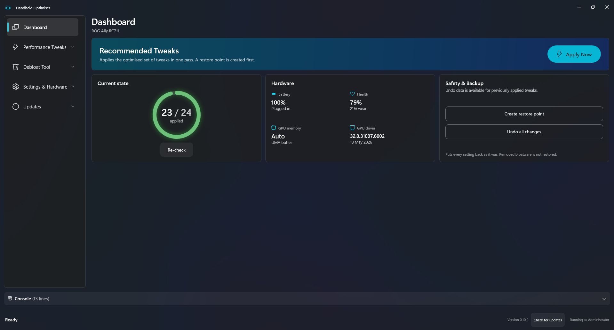
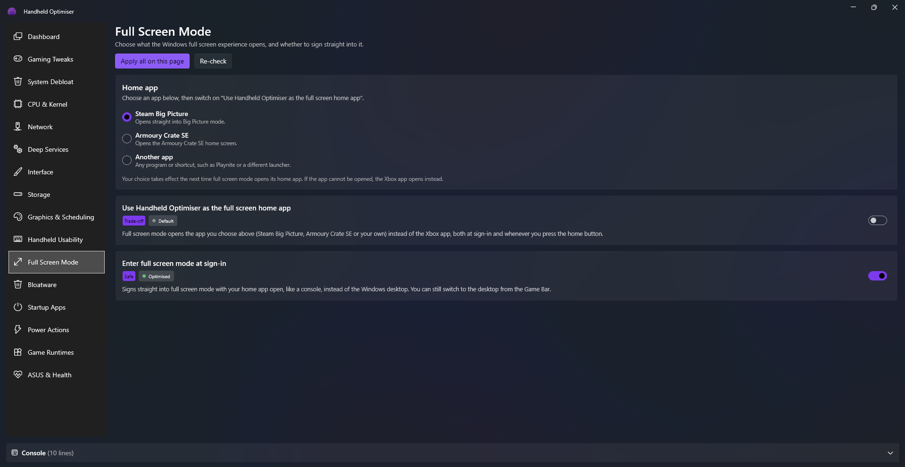

<p align="center">
  
</p>

<h1 align="center">Handheld Optimiser</h1>

<p align="center">
  A Windows tuning app for the ASUS ROG Ally and other Windows handhelds.<br>
  More frames, less clutter, and a console-style full screen mode, with every change reversible.
</p>

<p align="center">
  <a href="https://github.com/Vip3RAli/handheld-optimiser/releases/latest"><b>Download the latest release</b></a>
</p>

<p align="center">
  
</p>

---

## What it does

Windows ships set up for a desktop PC, not a 7-inch handheld. Handheld Optimiser applies the changes handheld owners usually make by hand from forum posts and scripts, from one touch-friendly app:

- **One-Click Optimise** applies the recommended performance and debloat tweaks in a single pass.
- **Individual toggles** for every tweak, grouped by area, each showing whether it is currently applied.
- **Xbox mode home app**: make Windows' full screen experience open Steam Big Picture, Armoury Crate SE or any launcher you choose.
- **Maintenance tools**: clear shader caches, free space with Compact OS, install missing game runtimes, and remove preinstalled apps.

## Built to be undone

Every system change goes through the same safety checks:

- **A System Restore point is created first.** If Windows cannot create one, nothing is changed.
- **Every tweak records the original setting**, so it can be reverted on its own or all at once with **Revert all tweaks** on the Dashboard, even after restarting or updating the app.
- **Protected components are never touched**, whatever a tweak asks for: Windows Update, Microsoft Defender, the firewall, your handheld's own software (Armoury Crate SE and ASUS services, Legion Space and Lenovo services, MSI Center M), AMD and Intel drivers, Realtek audio and Game Pass. The one exception is the optional **Turn off update sharing with other PCs** switch, which changes a single Delivery Optimization setting; updates still download as normal.
- **Trade-offs are shown up front.** Anything that lowers security or turns off a feature is labelled on its card and listed in the confirmation before it runs.

## Install

1. Download **HandheldOptimiser-Setup-&lt;version&gt;.exe** from the [latest release](https://github.com/Vip3RAli/handheld-optimiser/releases/latest).
2. Run it. Windows may show "Windows protected your PC" because the installer is not code-signed yet: choose **More info**, then **Run anyway**.
3. Accept the administrator prompt. The app needs administrator rights to change system settings, so Windows asks each time it opens.

.NET is bundled, so nothing else needs installing. New versions install over the old one and keep your undo history.

**Requirements:** Windows 10 (2004) or Windows 11, 64-bit. Full Screen Mode needs Windows 11 24H2 or later on a device with the Xbox full screen experience. Designed and tested on the ROG Ally. The app also recognises the ROG Xbox Ally, Lenovo Legion Go, MSI Claw, Steam Deck (running Windows), AYANEO, GPD and OneXPlayer handhelds, and the tweaks apply to any of them, but those devices have not been tested. A tweak that only fixes a fault on one device is badged with that device's name on any other.

## Features

The sidebar has four sections, sized for a thumb on a handheld's touch screen. Each section's pages are tabs across the top, and a section reopens on the tab you last used.

| Section | Tabs |
|---|---|
| **Dashboard** | One-Click Optimise, current state, hardware and safety |
| **Performance Tweaks** | Gaming Tweaks · CPU & Kernel · Graphics & Scheduling · Network · Storage · Sleep & Battery · Interface |
| **Debloat Tool** | System Debloat · Deep Services · Bloatware · Startup Apps |
| **Settings & Hardware** | Full Screen Mode · Power Actions · Game Runtimes · Device & System Health · Handheld Usability |

### Dashboard
A **One-Click Optimise** banner, then three cards: a ring showing how many of the recommended tweaks are applied, the hardware readings, and the restore point and **Revert all tweaks** buttons.

A **Hardware** card shows the battery's charge and live power draw in watts, its health (what it holds now against what it was built to hold), the memory set aside for graphics (the UMA buffer) and the installed graphics driver. It only reads; nothing on it changes a setting.

One-Click Optimise includes turning off **Memory Integrity**, which is usually the biggest single frame rate gain on the Ally but lowers protection against malicious drivers. The confirmation lists it, and every other trade-off, before anything runs. Virtual Machine Platform is left on because some anti-cheat games need it.

### Tweak pages

| Page | Tweaks |
|---|---|
| **Gaming Tweaks** | Disable Memory Integrity (HVCI) · Disable Virtual Machine Platform & VBS · Disable Game DVR background recording · Remove the Windows startup delay |
| **System Debloat** | Disable telemetry · Disable web results in Start search · Disable Cortana & Copilot · Stop app suggestions and silent reinstalls · Hide ads in Start, Settings and File Explorer · Turn off Widgets · Stop Edge running in the background · Turn off activity history and tailored experiences · Turn off Windows Error Reporting · Turn off OneDrive · Stop Store apps running in the background |
| **CPU & Kernel** | Maximise foreground priority, so the game gets the CPU ahead of background work |
| **Network** | Disable network throttling · Disable the network data usage monitor · Turn off update sharing with other PCs |
| **Deep Services** | Disable SysMain, Search Indexer, Print Spooler & Fax, Program Compatibility Assistant, Distributed Link Tracking, and other services a handheld does not use |
| **Interface** | Instant menus · Disable edge swipe gestures · Disable transparency and window animations |
| **Storage** | Disable last access timestamps · Disable 8.3 short file names · Turn off reserved storage |
| **Graphics & Scheduling** | Force Game Mode on · Optimise windowed and borderless games · Enable hardware-accelerated GPU scheduling |
| **Handheld Usability** | Disable the Sticky Keys and Filter Keys shortcuts · Disable power throttling |
| **Sleep & Battery** | Hibernate after 15 minutes of sleep · Turn Wi-Fi off during sleep · Only the power button wakes the handheld · Turn off the SD card reader (ROG Ally only) · Turn off Fast Startup |
| **Full Screen Mode** | Choose the home app · Use Handheld Optimiser as the home app · Enter full screen mode at sign-in |

### Full Screen Mode (Xbox mode home app)

Windows 11's full screen experience normally opens the Xbox app. Handheld Optimiser can replace it with the app you actually use:

<p align="center">
  
</p>

1. Open **Full Screen Mode** and choose **Steam Big Picture**, **Handheld Optimiser library**, **Armoury Crate SE**, or **Another app** (any program or shortcut, such as Playnite).
2. Switch on **Use Handheld Optimiser as the full screen home app**.
3. Optionally switch on **Enter full screen mode at sign-in** to boot straight into it like a console.

Handheld Optimiser then appears under **Settings > Gaming > Xbox mode > Choose home app**. Your choice can be changed at any time and applies the next time the home app opens. If the chosen app cannot start, the Xbox app opens instead, so you never land on a blank screen.

#### Handheld Optimiser library

A lightweight game library that replaces Big Picture as the home screen. It finds installed games from **Steam**, **Xbox / PC Game Pass**, **Epic Games**, **Battle.net**, **GOG**, the **EA App** and **Ubisoft Connect**, shows them as one grid with the game you played last first, and is driven with the controller (d-pad or left stick to move, **A** to play, **Y** to refresh) or by touch. The top bar shows the battery level, whether it is charging, and the Wi-Fi signal beside the clock.

- **Game Library** in the Start menu opens it directly, without changing your full screen home app.
- **LB / RB** filter the grid by store (All, Steam, Xbox and so on). The tabs can also be tapped.
- **X** on a game (or press and hold on touch) opens its quick actions: set extra launch arguments, open the install folder, view the executable's properties, or correct its background artwork. Launch arguments apply to Steam and GOG games; the other stores start their games themselves and take none.
- The power button beside the gear (or **View** on the controller) opens the power menu: sleep, hibernate, restart or shut down. Hibernate is listed only when it is switched on in Windows. Restart and shut down ask for a second press, so a stray button cannot end a session.
- The background is a gradient in the colours of the selected game's cover or icon, worked out on the device with nothing downloaded.
- The gear in the top bar (or **Menu** on the controller) opens the library's settings: the background (game colours, game artwork or plain), how strong the colours are, how blurred the artwork is (off, light, medium or strong) and whether it sits at the top or the bottom of the screen, the SteamGridDB key, on / off switches for the battery and Wi-Fi display, the store filter and the quick actions, **Open Handheld Optimiser** to bring up the main app (Windows asks for administrator permission; if the app is already open it just comes to the front), and **Quit** to close the library.
- Choose game artwork there, or switch on **Use game artwork as the library background** under **Full Screen Mode**, to show the game's whole banner artwork across the top or bottom of the screen, fading into its colours. Steam games use the artwork Steam already keeps on disk. For the other stores, enter a free [SteamGridDB](https://www.steamgriddb.com) API key and the library fetches each game's artwork once and keeps it in `%LOCALAPPDATA%\HandheldOptimiser\artwork`. Only then does the library contact SteamGridDB, sending the titles of those games to find them. Its only other use of the internet is the check for a newer release. A game with no artwork keeps its gradient. If a game gets the wrong picture or the wrong cover, **Background artwork** in its quick actions lets you give the title to look both up by.
- **Box art for every store.** Steam games show the cover Steam keeps on disk. With a free [SteamGridDB](https://www.steamgriddb.com) API key entered, games from the other stores (Xbox and Game Pass, Epic, GOG, Battle.net, EA, Ubisoft) get a portrait cover too, in place of their icon. Covers are fetched once, a few at a time when the library opens, and kept in `%LOCALAPPDATA%\HandheldOptimiser\artwork`. This happens whatever background you chose: once a key is set, the titles of games without a cover are sent to SteamGridDB to find them. A game SteamGridDB has no cover for keeps its icon.

| | RAM |
|---|---|
| Steam Big Picture, open | about 1.4 GB |
| Library, open | about 115 MB |
| Library, while a game runs | about 25 MB |

Each store's own app still starts when one of its games needs it: Steam runs silently in the background (so Steam Input and the overlay still work), Epic opens minimised, Blizzard games go through Battle.net, and EA and Ubisoft games bring up the EA App and Ubisoft Connect. An EA or Ubisoft game bought on Steam or Epic is listed once, under the store it was bought from. Most GOG games are DRM-free and start directly, with no client at all. The library stays open behind the game, so quitting a game or pressing the home button lands back on it. While a game is in front, it stops reading the controller and gives its memory back to Windows.

Controller tips:

- Keep the controller in **Gamepad** mode (Command Center in Armoury Crate SE). In Desktop mode the d-pad still works, as arrow keys, but the sticks turn into a mouse.
- Steam can take over the Xbox button and third-party controllers while it runs. If the home button opens Steam, or an external controller moves the wrong way, turn off Steam's guide button setting under **Steam > Settings > Controller**, and turn off Steam Input for that controller.

How it works: the app registers a small package that adds it to Windows' home app list and points at a lightweight launcher, which runs without administrator rights so full screen mode never shows a UAC prompt. Windows only accepts this kind of registration while developer mode is on and the package's certificate is trusted, so for the few seconds registration takes, developer mode is switched on and the certificate is trusted, then both are put back. No certificate is left installed. If Handheld Optimiser is closed midway, the next start finishes putting them back.

**Updating from 0.4.0 or earlier:** those versions registered an unsigned package that Windows rejects after a restart, so full screen mode opened to a blank grey screen. Open **Full Screen Mode** and switch on **Use Handheld Optimiser as the full screen home app** once to replace it. If you are stuck on the grey screen, press Ctrl+Alt+Del, open Task Manager, choose **Run new task** and run `explorer` to get the desktop back.

### Bloatware
Remove preinstalled apps such as TikTok, Candy Crush, Disney+, Bing News and Copilot. Nothing is selected until you choose it, and apps you may want to keep are marked with a note. Store, Xbox, Game Pass, codec and vendor packages are protected.

### Startup Apps
Turn startup programs on or off, including 32-bit ones. Uses the same switch as Task Manager, so changes show up there too.

### Power Actions
One-off jobs, each run with a button:

| Action | What it does |
|---|---|
| **Flush DNS & reset Winsock** | Fixes online games that cannot connect or suddenly lag |
| **Clear shader caches** | Fixes stutter or graphical glitches after a driver update |
| **Force deep cleanup** | Removes superseded Windows Update files, crash dumps and error reports |
| **Compact OS** | Compresses Windows system files to free a few GB for games |
| **Undo Compact OS** | Reverses it, after checking there is enough free space |

### Game Runtimes
Scans for the Visual C++, DirectX, .NET, XNA, OpenAL and PhysX runtimes games depend on, and installs or updates them through winget.

### Device & System Health
Checks that your handheld's own services (Armoury Crate on a ROG Ally, Legion Space on a Legion Go, MSI Center M on an MSI Claw) and the AMD, Realtek, Defender, Windows Update and Game Pass services are running, and can re-enable any that were disabled by other tools.

## Updating

From 0.3.0, the app checks for a newer release each time it starts, and **Check for updates** in the status bar checks on demand. When one is available, a banner offers **Update now**: the app downloads the installer, checks its signature, installs it and reopens by itself. Your applied tweaks and undo history are kept.

From 0.7.1, the game library shows the same banner, and looks for a newer release when it opens and about once a day while it stays open. It only asks GitHub for the latest version number. **Update now** there (also the first row of the library's settings on the controller) opens the main app, which asks for administrator permission and then installs the update as above. The library never downloads or runs an installer itself.

Every release is signed with the developer's own key, and the app refuses to install anything whose signature does not match, even a file that has been swapped on GitHub. Versions before 0.3.0 have no updater, so install 0.3.0 by hand once.

## Uninstalling

Uninstall from **Settings > Apps > Installed apps**. Uninstalling removes the app but **does not undo tweaks**; use **Revert all tweaks** first if you want Windows put back as it was. Your undo history is kept, so reinstalling later can still revert everything. If Handheld Optimiser was your full screen home app, Windows goes back to the Xbox app.

## FAQ

**Why does Windows ask for administrator permission every time?**
Almost every change the app makes is machine-wide, so Windows requires it. The full screen home app launcher is separate and never asks.

**Why does Windows warn that the installer is unrecognised?**
The installer is not signed with a paid code-signing certificate yet. The SHA-256 hash of each installer is listed in its release notes if you want to verify your download.

**Something went wrong. What do I do?**
Use **Revert all tweaks** on the Dashboard, or roll back with the System Restore point the app created. Each session is logged to `%LOCALAPPDATA%\HandheldOptimiser\logs`, which is the most useful thing to attach to an issue.

## Building from source

Requires Windows, the .NET 8 SDK and Inno Setup 6.

```powershell
winget install --id JRSoftware.InnoSetup -e --scope user
.\installer\build-installer.ps1
```

This publishes a self-contained build, packs the full screen home app registration, and writes `artifacts\HandheldOptimiser-Setup-<version>.exe`. The version comes from `<Version>` in `src\HandheldOptimiser\HandheldOptimiser.csproj`.

Run the tests with `dotnet test`. They cover undo and the protected lists, and run against an in-memory registry and undo journal, so they never touch the real registry, services or packages. GitHub Actions builds and tests every push to `main` and every pull request.

### Signing releases for the in-app updater

If the update signing key is present, the build script also writes `HandheldOptimiser-Setup-<version>.exe.sig` and checks it against the public key built into the app. Upload **both files** to the release; without the `.sig`, the updater tells users to install that release by hand.

The key is managed with `tools\UpdateSigner` and never goes in the repository:

```powershell
dotnet run --project tools\UpdateSigner -- keygen                  # once; prints the public key for Services\UpdateService.cs
dotnet run --project tools\UpdateSigner -- export-backup key.pem   # password-protected backup; keep it off this PC
dotnet run --project tools\UpdateSigner -- import-backup key.pem   # restore on a new PC
```

It is stored in `%APPDATA%\HandheldOptimiser-Signing`, encrypted to your Windows account. If it is lost, installed copies can no longer verify updates, and everyone has to install the next release by hand once.

| Folder | Contents |
|---|---|
| `src/HandheldOptimiser` | The WPF app. Tweaks are declared in `TweakDefinitions/`; `Services/TweakEngine.cs` applies them with the restore point and undo journal, and `Services/SafetyGuard.cs` holds the protected list |
| `src/HandheldOptimiser.HomeLauncher` | The small launcher Windows starts as the full screen home app |
| `installer` | Inno Setup script, build script, and the home app registration package in `HomeApp/` |
| `tests/HandheldOptimiser.Tests` | xUnit tests for revert (`TweakEngine`) and the protected lists (`SafetyGuard`) |
| `tools/UpdateSigner` | Creates the update signing key and signs installers; release tooling only, never shipped |

## Credits

- Full screen home app approach learned from [AnyFSE](https://github.com/ashpynov/AnyFSE) by Artem Shpynov (MIT).
- UI built with [WPF-UI](https://github.com/lepoco/wpfui) and the [CommunityToolkit MVVM](https://github.com/CommunityToolkit/dotnet) library.
