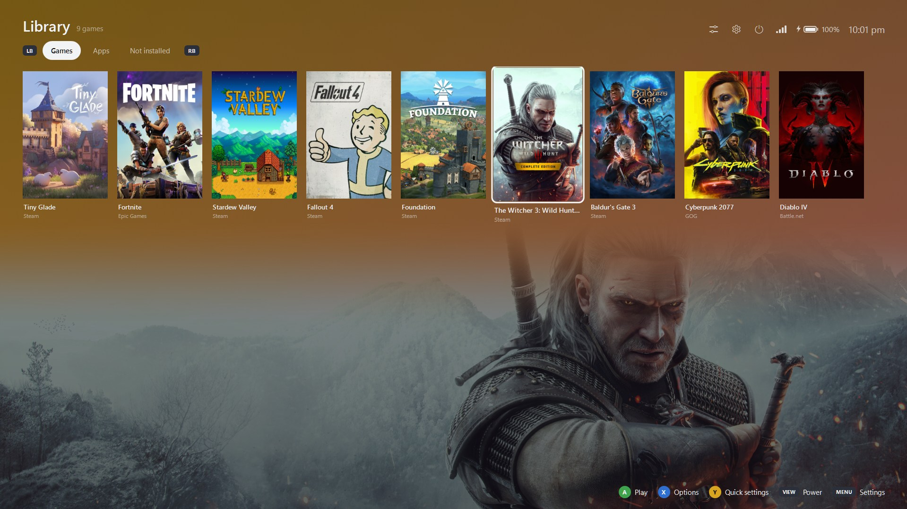

<p align="center">
  
</p>

<h1 align="center">Handheld Optimiser</h1>

<p align="center">
  A Windows tuning app for the ASUS ROG Ally and other Windows handhelds.<br>
  More frames, less clutter, and a console-style full screen mode, with every change reversible.
</p>

<p align="center">
  <a href="https://github.com/Vip3RAli/handheld-optimiser/releases/latest"><b>Download the latest release</b></a>
</p>

<p align="center">
  
</p>

---

## What it does

Windows ships set up for a desktop PC, not a 7-inch handheld. Handheld Optimiser applies the changes handheld owners usually make by hand, from one touch-friendly app:

- **Apply Now** applies the recommended performance and debloat tweaks in a single pass.
- **Individual toggles** for every tweak, each showing whether it is applied.
- **A game library** for full screen mode, driven with the controller, that uses a fraction of Big Picture's memory.
- **One place for updates**: Windows Update, Microsoft Store apps, other apps and game runtimes.
- **Maintenance tools**: clear shader caches, free up space and remove preinstalled apps.

## Built to be undone

- **A System Restore point is created first.** If Windows cannot create one, nothing is changed.
- **Every tweak records the original setting**, so it can be reverted on its own or all at once with **Undo all changes**, even after a restart or an update.
- **Protected components are never touched**: Windows Update, Microsoft Defender, the firewall, your handheld's own software, graphics and audio drivers, and Game Pass.
- **Trade-offs are shown up front.** Anything that lowers security or turns off a feature is labelled and listed in the confirmation before it runs.

## Install

1. Download **HandheldOptimiser-Setup-&lt;version&gt;.exe** from the [latest release](https://github.com/Vip3RAli/handheld-optimiser/releases/latest).
2. Run it. Windows may show "Windows protected your PC" because the installer is not code-signed yet: choose **More info**, then **Run anyway**.
3. Accept the administrator prompt. The app changes system settings, so Windows asks each time it opens.

.NET is bundled. New versions install over the old one and keep your undo history.

**Requirements:** Windows 10 (2004) or Windows 11, 64-bit. Full Screen Mode needs Windows 11 24H2 or later on a device with the Xbox full screen experience. Designed and tested on the ROG Ally. The ROG Xbox Ally, Legion Go, MSI Claw, Steam Deck (running Windows), AYANEO, GPD and OneXPlayer are recognised but untested.

## The app

Tap a section in the sidebar to drop down its pages.

| Section | Pages |
|---|---|
| **Dashboard** | Apply Now, how many recommended tweaks are applied, hardware readings, restore point and undo |
| **Performance Tweaks** | Gaming Tweaks · CPU & Kernel · Graphics & Scheduling · Network · Storage · Sleep & Battery · Interface |
| **Debloat Tool** | System Debloat · Deep Services · Bloatware · Startup Apps |
| **Settings & Hardware** | Full Screen Mode · Power Actions · Device & System Health · Handheld Usability |
| **Updates** | Updates · Game Runtimes |

- **Apply Now** includes turning off **Memory Integrity**, usually the biggest frame rate gain on the Ally, at the cost of some protection against malicious drivers. The confirmation lists every trade-off first.
- **Bloatware** removes preinstalled apps such as TikTok, Candy Crush and Copilot. Nothing is selected until you choose it.
- **Power Actions** are one-off jobs: flush DNS, clear shader caches, deep cleanup and Compact OS.
- **Device & System Health** checks that your handheld's own services are running and can re-enable any that other tools disabled.
- **Updates** lists Windows, Store and winget updates together and installs the ones you tick. Driver updates are off unless you switch them on. Games, the BIOS and firmware are not listed.

## Full Screen Mode and the game library

Windows 11's full screen experience normally opens the Xbox app. Handheld Optimiser can open its own game library there, or Steam Big Picture, Armoury Crate SE or any other launcher.

<p align="center">
  
</p>

1. Open **Full Screen Mode** and choose **Handheld Optimiser library** or **Another launcher**.
2. Switch on **Use Handheld Optimiser as the full screen home app**.
3. Optionally switch on **Enter full screen mode at sign-in** to boot straight into it like a console.

If the chosen app cannot start, the Xbox app opens instead. **Game Library** in the Start menu opens the library without changing your home app.

The library finds installed games from **Steam**, **Xbox / PC Game Pass**, **Epic Games**, **Battle.net**, **GOG**, the **EA App** and **Ubisoft Connect**, plus programs you add and games in your ROM folders.

| Feature | What it does |
|---|---|
| **Tabs** | Games, Favourites, one per store, Apps and Not installed. **LB / RB** switch between them. |
| **Quick settings** (**Y**) | Volume, brightness, power mode, resolution and refresh rate. |
| **Quick actions** (**X**) | Favourite or hide a game, set its game profile, launch arguments or artwork. |
| **Game profiles** | A power mode, resolution, refresh rate and brightness per game, put back when it closes. |
| **Continue playing** | Your last game as a wide card above the grid, with play time tracked for every game. |
| **Quick Resume** | The home button pauses the game behind the library, and **A** carries on where you left off. Games with anti-cheat are never paused. |
| **Play and Sleep** | Close background programs and store apps around a game, and go back to your game after sleep. |
| **Docked mode** | A layout and zoom of its own on a TV or monitor. |
| **Not installed** | Games you own on Steam, Epic and GOG, ready to install. Steam needs your own free Web API key. |
| **Game deals** | An optional row of games on sale, from IsThereAnyDeal with your own free API key. |
| **Emulators** | Games from your ROM folders, including EmuDeck's and RetroBat's, in the emulator found for each console. |
| **Quick Tweaks** | Clear temporary files, shader caches and the Recycle Bin, and switch startup apps. |
| **Power** (**View**) | Sleep, hibernate, restart or shut down. |

Everything works with the controller or by touch. **Menu** opens the settings, and **Up** from the top row reaches the quick settings, settings and power buttons.

| | RAM |
|---|---|
| Steam Big Picture, open | about 1.4 GB |
| Library, open | about 115 MB |
| Library, while a game runs | about 25 MB |

**Privacy.** The library only uses the internet to check for a newer release, and for the features you switch on with your own keys: artwork from [SteamGridDB](https://www.steamgriddb.com), your Steam game list and wishlist, store covers for games you have not installed, and deals from [IsThereAnyDeal](https://isthereanydeal.com). Keys stay on your device.

**Controller tips.** Keep the controller in **Gamepad** mode. If the home button opens Steam, turn off Steam's guide button setting under **Steam > Settings > Controller**.

## Updating

The app checks for a newer release when it starts, and the library does the same. **Update now** downloads the installer, checks its signature, installs it and reopens. Your tweaks and undo history are kept. Every release is signed with the developer's key, and the app refuses anything whose signature does not match.

## Uninstalling

Uninstall from **Settings > Apps > Installed apps**. This removes the app but **does not undo tweaks**; use **Undo all changes** first if you want Windows put back as it was. Your undo history is kept, so reinstalling later can still revert everything.

## FAQ

**Why does Windows ask for administrator permission every time?**
Almost every change the app makes is machine-wide. The game library is separate and never asks.

**Why does Windows warn that the installer is unrecognised?**
The installer is not signed with a paid code-signing certificate yet. Each release lists the installer's SHA-256 hash if you want to verify your download.

**Something went wrong. What do I do?**
Use **Undo all changes** on the Dashboard, or roll back with the System Restore point the app created. Logs are in `%LOCALAPPDATA%\HandheldOptimiser\logs`; attach them to an issue.

**Full screen mode opens to a blank grey screen.**
This affected 0.4.0 and earlier. Open **Full Screen Mode** and switch on **Use Handheld Optimiser as the full screen home app** once to fix it.

## Building from source

Requires Windows, the .NET 8 SDK and Inno Setup 6.

```powershell
winget install --id JRSoftware.InnoSetup -e --scope user
.\installer\build-installer.ps1
```

This writes `artifacts\HandheldOptimiser-Setup-<version>.exe`. The version comes from `<Version>` in `src\HandheldOptimiser\HandheldOptimiser.csproj`. Run the tests with `dotnet test`; they never touch the real registry, services or packages.

If the update signing key is present, the script also writes a `.sig` file. Upload both files to the release, or the in-app updater will not install it. The key is managed with `tools\UpdateSigner` (`keygen`, `export-backup`, `import-backup`) and never goes in the repository.

| Folder | Contents |
|---|---|
| `src/HandheldOptimiser` | The WPF app: tweak definitions, the tweak engine and the protected list |
| `src/HandheldOptimiser.HomeLauncher` | The launcher and game library Windows starts as the full screen home app |
| `installer` | Inno Setup script, build script and the home app registration package |
| `tests/HandheldOptimiser.Tests` | xUnit tests for undo, the protected lists and the library |
| `tools/UpdateSigner` | Creates the update signing key and signs installers; never shipped |

## Credits

- Full screen home app approach learned from [AnyFSE](https://github.com/ashpynov/AnyFSE) by Artem Shpynov (MIT).
- UI built with [WPF-UI](https://github.com/lepoco/wpfui) and the [CommunityToolkit MVVM](https://github.com/CommunityToolkit/dotnet) library.
